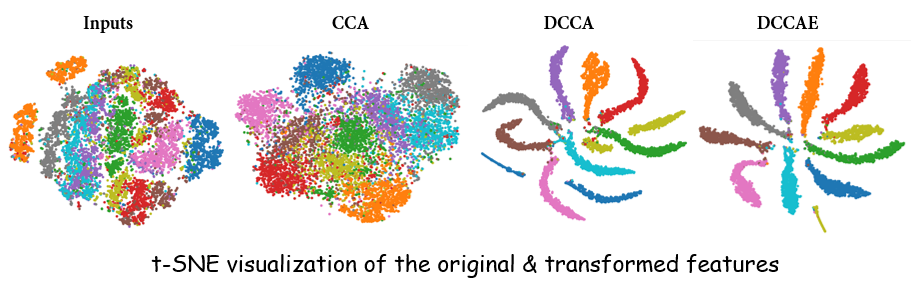
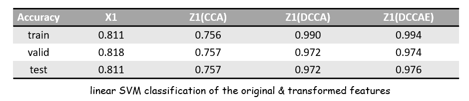
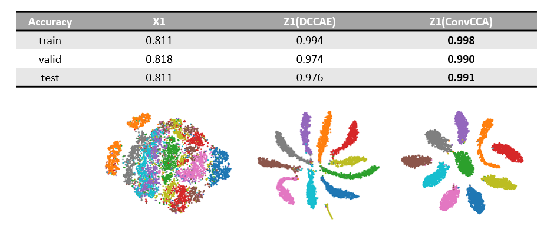

# CCA, DCCA, DCCAE, ConvCCA

This repo contains a pytorch implementation of DCCA, DCCAE, and a CNN-based DCCA.

Please see `/data/readme.md` for data preparation of Noisy MNIST.

### Performance

Reproduce the paper:

Results of `ConvCCA`: 

### Differences from the paper:

* Use ReLU instead of Sigmoid/Non-saturating Sigmoid

* Use ADAM optimizer instead of RMSProp/SGD/…

* Add BatchNorm after each layer.

* DCCAE's AE parts are pretrained with ADAM.

  

### References:

* [DeepCCA](https://github.com/Michaelvll/DeepCCA)
* [On Deep Multi-View Representation Learning](http://proceedings.mlr.press/v37/wangb15.pdf)
